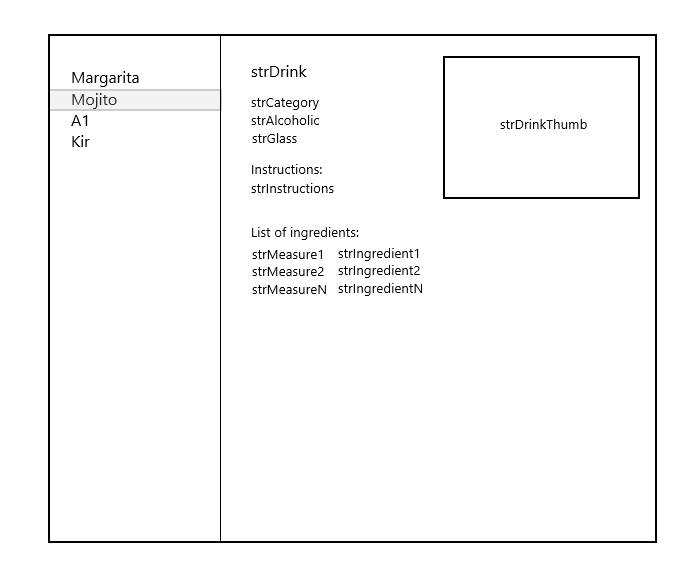

# Test task

[![TypeScript][typescript-badge]][typescript-url]
[![eslint][eslint-badge]][eslint-url]
[![prettier][prettier-badge]][prettier-url]
[![vitest][vitest-badge]][vitest-url]
[![tailwind][tailwind-badge]][tailwind-url]


Задача:
Реализовать приложение с выводом данных полученных по API.
Пример схематичного интерфейса приложения изображен в app_example.png



Исходные данные:
- Всю необходимую информацию запрашиваем по GET-запросу: https://www.thecocktaildb.com/api/json/v1/1/search.php?s=<cocktail_code>
- Доступные cocktail_code: margarita, mojito, a1, kir

Функциональные требования:
- Использовать менеджер состояния для сохранения данных и исключения дублирующих запросов
- Список кодов (cocktail_code) использовать для названия пунктов меню и формирования url-страниц
- Каждый пункт меню ведет на страницу со своим описанием
- Активный пункт меню должен быть выделен
- По умолчанию первый пункт меню, являеться главной страницей и использует его же урл
- Переход на url-адрес "/", должен отправлять пользователя на url-первого пункта меню
- При переходе на несуществующую страницу, показать 404 ошибку в произвольной форме
- Резиновая верстка интерфейса. Максимальная ширина 1024px, минимальная 360px
- lazy-loading для загрузки изображений

Требования по стеку на выбор:
- vue 2/3 + vuex/pinia, react + redux/mobx
- webpack, vite
- eslint
- html 5, css 3
- scss/sass, stylus, less, postCSS
- Адаптивная верстка (chrome, safari)
- typescript (опционально)
- jest (опционально)

По окончанию:
- выложить в репозиторий

## Type Support for `.vue` Imports in TS

TypeScript cannot handle type information for `.vue` imports by default, so we replace the `tsc` CLI with `vue-tsc` for type checking. In editors, we need [Volar](https://marketplace.visualstudio.com/items?itemName=Vue.volar) to make the TypeScript language service aware of `.vue` types.


## Project Setup

```sh
npm install
```

### Install Husky

```sh
npm run husky-install
```

### Compile and Hot-Reload for Development

```sh
npm run dev
```

### Type-Check, Compile and Minify for Production

```sh
npm run build
```

### Lint with [ESLint](https://eslint.org/)

```sh
npm run lintfix
```

### Run test with [Vitest](https://vitest.dev/)

```sh
npm run test:run
```


[typescript-badge]: https://badges.frapsoft.com/typescript/code/typescript.svg?v=101
[typescript-url]: https://github.com/microsoft/TypeScript
[prettier-badge]: https://img.shields.io/badge/code_style-prettier-ff69b4.svg
[prettier-url]: https://github.com/prettier/prettier
[eslint-badge]: https://img.shields.io/badge/code_style-eslint-blue
[eslint-url]: https://eslint.org/
[vitest-badge]: https://img.shields.io/badge/test-vitest-green
[vitest-url]: https://vitest.dev/
[tailwind-badge]: https://img.shields.io/badge/utility-tailwind-yellow
[tailwind-url]: https://vitest.dev/

